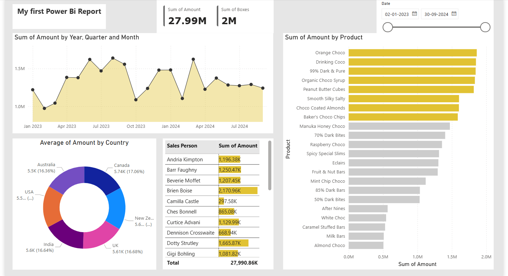

# 📊 Chocolate Sales Data Analysis – Power BI Project

## 📌 Project Overview

This project is an interactive Power BI dashboard built to analyze chocolate sales data.  
The dashboard provides insights into total sales, product performance, country distribution, and sales trends over time.

This project demonstrates data cleaning, basic aggregation, and dashboard design using Power BI.

---

## 🎯 Business Objectives

- Analyze overall sales performance
- Track monthly sales trends
- Identify top-selling products
- Compare country-wise performance
- Evaluate sales person contributions

---

## 🛠 Tools Used

- Power BI Desktop
- Microsoft Excel
- Power Query (Data Cleaning & Transformation)

---

## 📊 Key Metrics (KPIs)

- Total Sales (27.99M)
- Total Boxes Sold (2M)
- Sales by Product
- Sales by Country
- Monthly Sales Trend
- Sales Person Performance

---

## 📸 Dashboard Preview

---

## 📈 Key Insights

- Total Sales reached 27.99M.
- 2M total boxes were sold.
- Certain products generate higher revenue compared to others.
- Sales trend fluctuates across months.
- Some sales persons contribute significantly more revenue.

---

**Prasanth Varma**  
Aspiring Data Analyst
Aspiring Data Analyst
